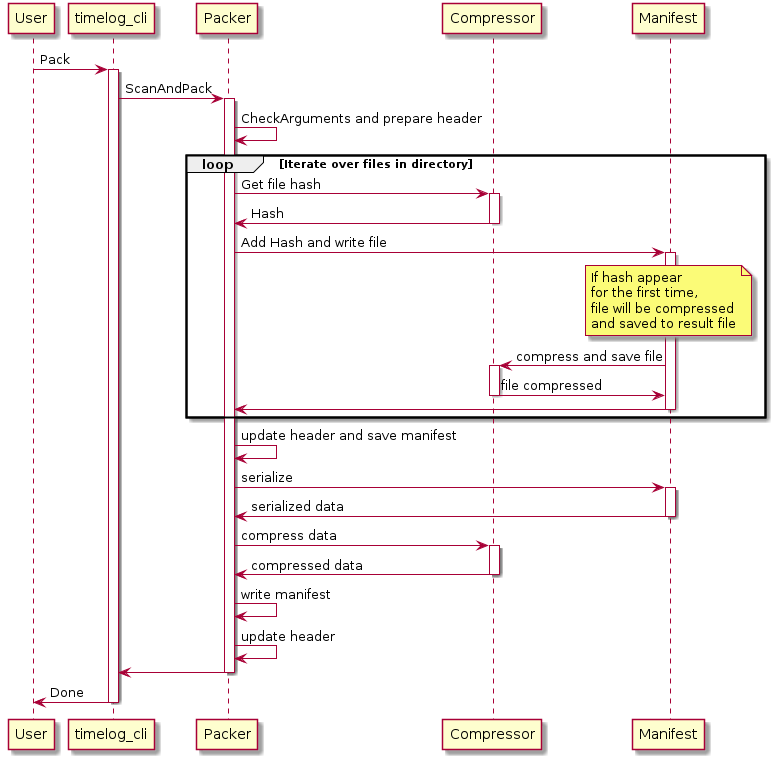
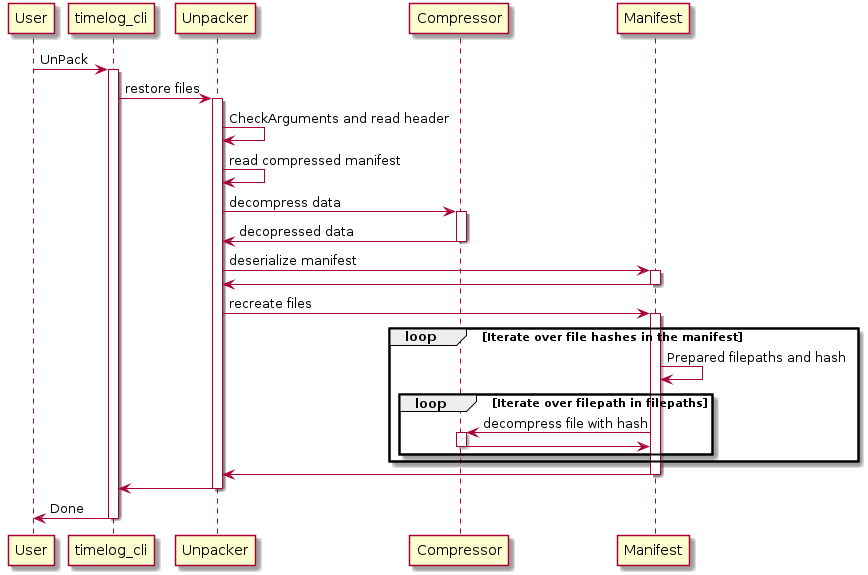
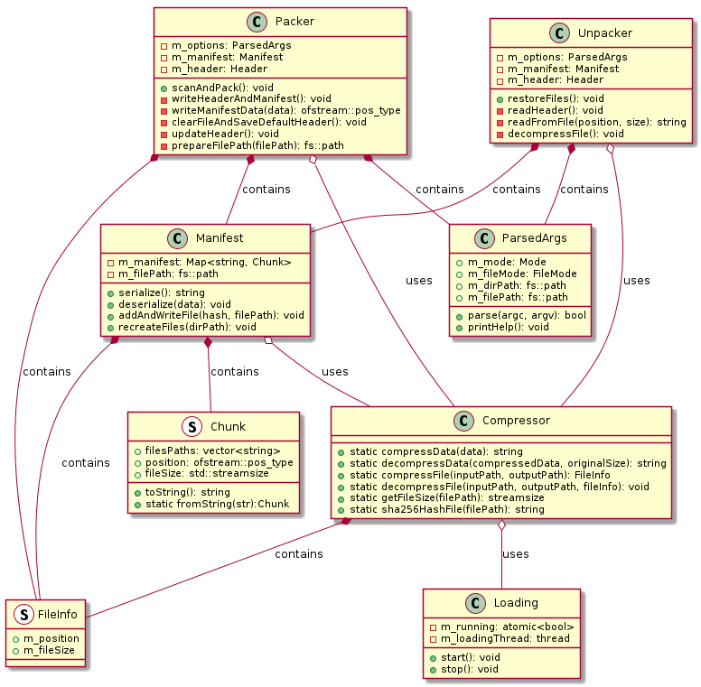

# TimeLog
## Prerequisites
Install Linux packages:

```bash
sudo apt install cmake
sudo apt install g++
sudo apt install libssl-dev
sudo apt install zlib1g-dev
```

## Compilation
Run cmake:
```bash
cmake -H. -Bbuild
```

Compile source code:
```bash
cmake --build build
```

Compiled application can be found here:
```bash
build/timelog_cli
```

## Usage

```bash
timelog_cli
[--mode=<Pack/UnPack>]
[--dir_path=<directory_path>] - mode=Pack: compress this directory, mode=UnPack: decompress to this directory
[--file=<output/input_file>]
[--file_mode=Compressed - optional parameter for additional compression of result file, mode=Pack: second file will be produced with extension ".compressed", mode=UnPack: ]
```

### Example:
Compression: 
```bash
timelog_cli --dir_path="test_directory" --file="test_output/file.data" --mode=Pack
```
Decompression:
```bash
timelog_cli --dir_path="test_output" --file="test_output/file.data" --mode=UnPack
```

Additional compression:
```bash
timelog_cli --dir_path="test_directory" --file="test_output/file.data" --mode=Pack --file_mode=Compressed
```

```bash
timelog_cli --dir_path="test_output" --file="test_output/file.data" --mode=UnPack --file_mode=Compressed
```

## Documentation

### Sequence diagram for Pack mode without additional compression



### Sequence diagram for UnPack mode without additional compression



### Class diagram



## Notes

### Why flag --file_mode=Compressed was added

During testing I observed that not every time compression of entire file really reduce result file size. For example when test_directory cantain a lot of very similar packs (binary the same) of files (only one byte is different) then compression of result file reduce size. When test_directory contain different packs of files then compression of result file often increase size.

## What next

1. Add unit tests.
2. Create devcontainer for development.
3. Add some automatic smoke tests.
