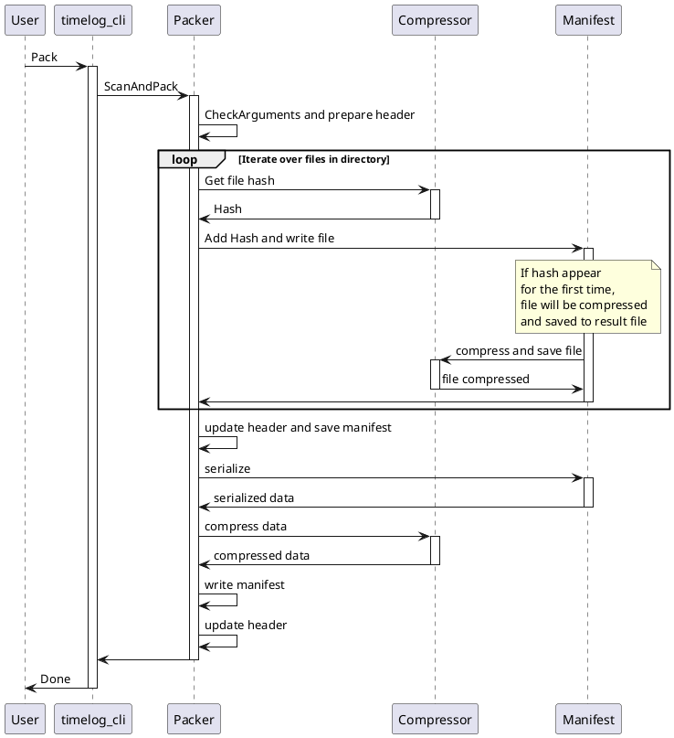
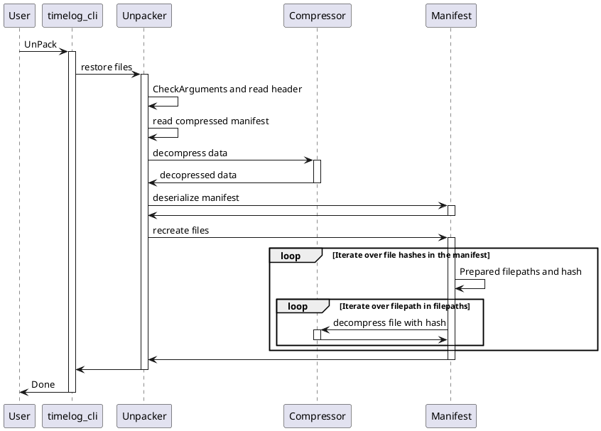
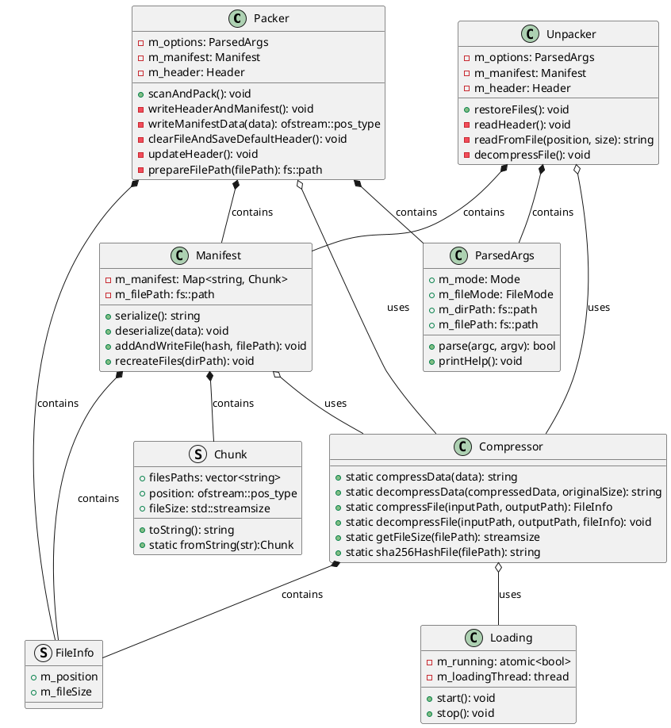

# TimeLog
## Prerequisites
Install Linux packages:

```bash
sudo apt install cmake
sudo apt install g++
sudo apt install libssl-dev
sudo apt install zlib1g-dev
```

## Compilation
Run cmake:
```bash
cmake -H. -Bbuild
```

Compile source code:
```bash
cmake --build build
```

Compiled application can be found here:
```bash
build/timelog_cli
```

## Usage
```bash
timelog_cli
[--mode=<Pack/UnPack>]
[--dir_path=<directory_path>] - mode=Pack: compress this directory, mode=UnPack: decompress to this directory
[--file=<output/input_file>]
[--file_mode<Compressed> - optional parameter for additional compression of result file, mode=Pack: second file will be produced with extension ".compressed", mode=UnPack: ]

Example:
Compression: timelog_cli --dir_path="test_directory" --file="test_output/file.data" --mode=Pack
Decompression: timelog_cli --dir_path="test_output" --file="test_output/file.data" --mode=UnPack

Additional compression:
timelog_cli --dir_path="test_directory" --file="test_output/file.data" --mode=Pack --file_mode=Compressed
timelog_cli --dir_path="test_output" --file="test_output/file.data" --mode=UnPack --file_mode=Compressed
```

## Documantation

### Sequnce diagram for Pack mode without additional compression


### Sequnce diagram for UnPack mode without additional compression


### Class diagram
